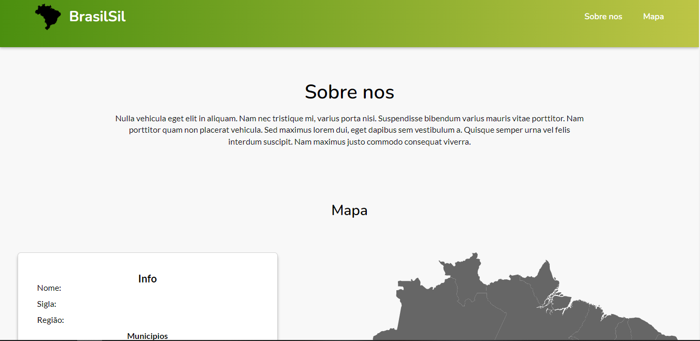

<h1 align="center">
   Mapa do Brasil
</h1>

  <a href="https://willianstephano.github.io/Mapa-do-Brasil/">
    <b>🚀Acesse o projeto 🚀</b>
  </a>
  
 <h5 align="center">
  Projeto em construção
</h5>

<h4 align="center">
  Projeto criado com o intuito de aprimorar meus conhecimentos nas tecnologias HTML, CSS e JS.
</h4>

<h6 align="center">
  O projeto consome a Brasil API para consulta de dados dos estados e municipios
</h6>

## 📚 Seções
O projeto é composto por uma pagina que contem 2 seções principais e é meu primeiro projeto consumindo API:

- **Sobre nos:** Informações gerais sobre o site;
- **Mapa:** Mapa do Brasil que possui interação ao selecionar um estado mostra informações do mesmo vindo da API;

---

## 💼 Tecnologias utilizadas
Para o desenvolvimento deste projeto utilizei as seguintes tecnologias:

- HTML;
- CSS;
- JavaScript;
- API utilizada: https://brasilapi.com.br/docs;

---

#### Autor
Willian Stephano
